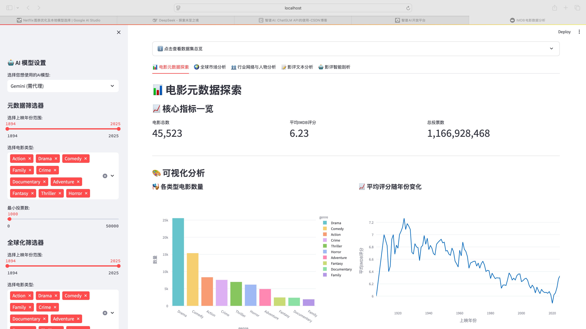
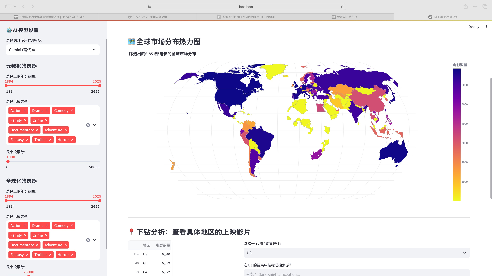
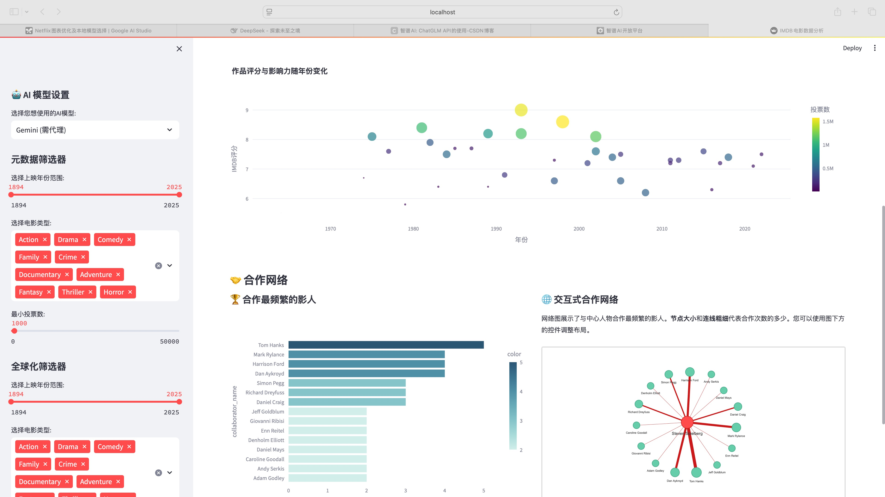
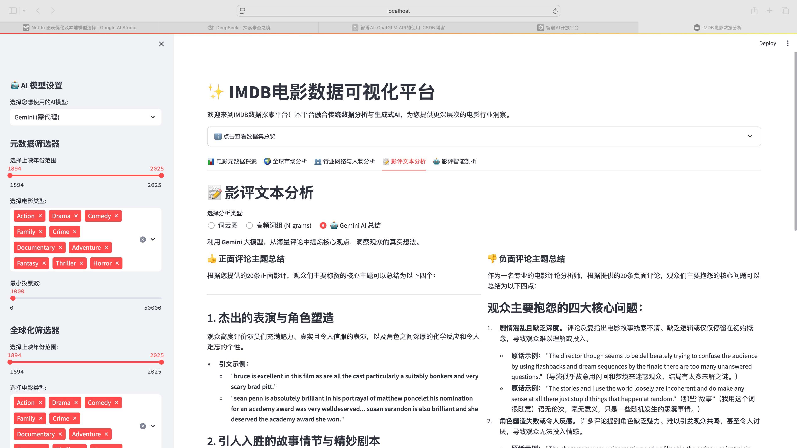

# IMDB 电影数据可视化平台 (JXNU2022级数据可视化课程设计)

[](https://www.python.org/)
[](https://streamlit.io/)
[](https://github.com/huggingface/transformers)
[](https://opensource.org/licenses/MIT)

一个功能强大的交互式Web应用，旨在深度探索IMDB电影数据集。本项目巧妙地将**传统数据可视化分析**与**现代生成式AI（LLM）**相结合，为用户提供从宏观市场趋势到微观文本情感的多维度洞察。

---

## ✨ 功能亮点

- **📊 电影元数据探索**: 通过交互式筛选器（年份、类型、投票数）动态分析电影数据，提供核心KPI、类型分布、评分趋势等多种可视化图表。

- **🌍 全球市场分析**: 以热力世界地图的形式，直观展示不同类型电影的全球上映热度，并支持下钻到具体国家/地区查看上映影片列表。

- **👥 行业网络与人物分析**:
  - **职业生涯轨迹**: 可视化展示任意影人（演员/导演）的职业生涯作品评分与影响力变化。
  - **合作网络**: 动态生成影人的合作关系网络图，一览其核心合作伙伴及合作频率。

- **📝 影评文本分析**:
  - **词云图 & N-grams**: 从海量影评中提取高频词和高频词组，直观对比正面与负面评价的关键词差异。
  - **AI 总结**: 利用大语言模型（LLM）自动从大量评论中提炼核心观点、赞美点和槽点，快速掌握观众反馈。

- **🤖 影评智能剖析**:
  - **本地模型情感分析**: 使用在IMDB数据集上**微调的DistilBERT模型**，实现快速、本地化的影评情感判断。
  - **LLM 深度分析**: 集成多种大语言模型（**Gemini, 智谱AI, 本地Ollama**），对单条影评进行多维度的深度剖析，包括总体情绪、关键方面分析和核心信息提炼。

## 📸 应用截图

|                   元数据探索                    |                  全球市场分析                   |
|:------------------------------------------:|:-----------------------------------------:|
|  |  |
|                  **人物分析**                  |                **影评智能剖析**                 |
|     |  |

## 🛠️ 技术栈

- **后端/Web框架**: Streamlit
- **数据处理**: Pandas, NumPy
- **数据可视化**: Plotly, Matplotlib, WordCloud, PyVis
- **机器学习/NLP**: Scikit-learn, Transformers (Hugging Face)
- **AI模型集成**: Google Generative AI (Gemini), ZhipuAI (智谱AI), Requests (for Ollama)
- **数据格式**: Parquet (用于高效存储预处理数据)

## 🚀 部署与运行

请按照以下步骤在您的本地环境中设置并运行此项目。

### 1. 克隆仓库

```bash
git clone https://github.com/your-username/your-repository-name.git
cd your-repository-name
```

### 2. 创建并激活虚拟环境

建议使用虚拟环境以避免包版本冲突。

```bash
python -m venv venv
# Windows
venv\Scripts\activate
# macOS/Linux
source venv/bin/activate
```

### 3. 安装依赖

```bash
pip install -r requirements.txt
```

### 4. 下载原始数据集

应用运行需要IMDB的原始数据集。请下载以下文件并全部放入项目根目录下的 `data` 文件夹中（如果 `data` 文件夹不存在，请手动创建）。

- **IMDB官方数据集 (TSV格式)**:
  - `name.basics.tsv.gz`
  - `title.akas.tsv.gz`
  - `title.basics.tsv.gz`
  - `title.crew.tsv.gz`
  - `title.principals.tsv.gz`
  - `title.ratings.tsv.gz`
  
  **下载地址**: [https://developer.imdb.com/non-commercial-datasets/](https://developer.imdb.com/non-commercial-datasets/)

- **IMDB影评数据集 (CSV格式)**:
  - `IMDB Dataset.csv`

  **下载地址**: [Kaggle - IMDB Dataset of 50K Movie Reviews](https://www.kaggle.com/datasets/lakshmi25npathi/imdb-dataset-of-50k-movie-reviews)

下载完成后，您的 `data` 目录结构应如下所示：
```
your-repository-name/
└── data/
    ├── IMDB Dataset.csv
    ├── name.basics.tsv.gz
    ├── title.akas.tsv.gz
    ├── title.basics.tsv.gz
    ├── title.crew.tsv.gz
    ├── title.principals.tsv.gz
    └── title.ratings.tsv.gz
```
*注意：`prepare_data.py` 和 `train_distilbert.py` 会直接读取`.gz`压缩文件，无需解压。*

### 5. 运行数据预处理脚本

此脚本会将原始数据处理成应用所需的高效 Parquet 格式，并进行预计算。**这是运行应用前必须执行的一步**。

```bash
python prepare_data.py
```
执行成功后，会在根目录下生成一个 `data_possessed` 文件夹，其中包含所有处理好的 `.parquet` 文件。

### 6. (可选) 训练本地情感分析模型

项目中提供了一个脚本 `train_distilbert.py` 用于微调 DistilBERT 模型。应用可以加载此本地模型进行情感分析。

```bash
python train_distilbert.py
```
执行成功后，会在根目录下生成一个 `distilbert-imdb-finetuned` 文件夹，其中包含训练好的模型和配置文件。如果您跳过此步，Tab 5 中的本地模型分析功能将无法使用，除非您从其他地方获取了兼容的模型文件并放在该路径下。

### 7. 配置AI模型API密钥

为了使用LLM功能（Gemini, 智谱AI），您需要在项目中配置API密钥。

1.  在项目根目录下创建一个名为 `.streamlit` 的文件夹。
2.  在该文件夹内创建一个名为 `secrets.toml` 的文件。
3.  将您的API密钥按以下格式填入文件：

```toml
# .streamlit/secrets.toml

GEMINI_API_KEY = "YOUR_GEMINI_API_KEY"
ZHIPU_API_KEY = "YOUR_ZHIPU_API_KEY"
```
- 如果您只使用其中一个或本地Ollama，只需填写您拥有的密钥即可。
- 如果您计划使用 **本地Ollama**，请确保您的Ollama服务正在运行。

### 8. 启动Streamlit应用

一切就绪！现在可以启动应用了。

```bash
streamlit run app.py
```

应用将在您的浏览器中自动打开。

## 📂 项目结构

```
.
├── .streamlit/
│   └── secrets.toml        # (需手动创建) AI模型API密钥
├── data/
│   └── ...                 # (需手动下载) 存放原始IMDB数据集
├── data_possessed/
│   └── ...                 # (自动生成) 存放预处理后的Parquet数据文件
├── distilbert-imdb-finetuned/
│   └── ...                 # (自动生成) 存放微调后的本地情感分析模型
├── app.py                  # Streamlit应用主文件
├── prepare_data.py         # 数据预处理和预计算脚本
├── train_distilbert.py     # (可选) 本地情感分析模型训练脚本
├── requirements.txt        # Python依赖包列表
└── README.md               # 本项目说明文件
```

## 🤝 贡献

欢迎任何形式的贡献！如果您有好的想法或发现了Bug，请随时提交 Pull Request 或创建 Issue。

## 📄 许可证

本项目采用 [MIT License](https://opensource.org/licenses/MIT) 授权。